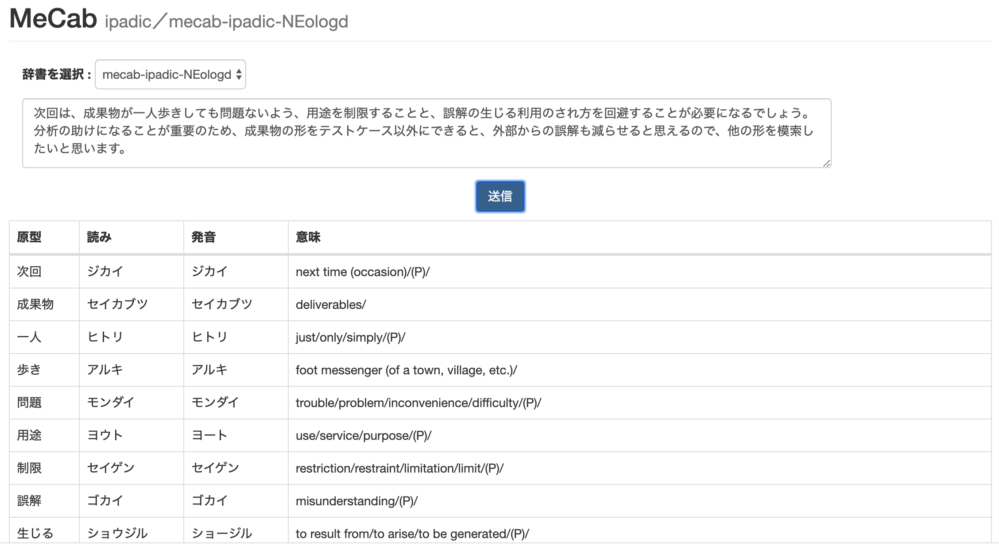

# MeCab Webサービス

docker-composeコマンドだけで起動できるMeCabサービス

* flask-mecab
  * MeCabを利用できるRESTfulなflaskサーバー
  * IPA辞書と新語辞書mecab-ipadic-neologdが選択できる

* flask-mecab-front
  * flask-mecabのAPIを呼び出すフロントエンドアプリ
  * 環境：Flask, Vue.js, Bootstrap3

## ディレクトリ構成

```text
.
├── docker-compose.yml
├── flask-mecab
│   ├── Dockerfile
│   ├── requirements.txt
│   └── server.py
├── flask-mecab-front
│   ├── app.py
│   ├── Dockerfile
│   ├── requirements.txt
│   ├── static
│   │   ├── app.js
│   │   └── style.css
│   └── templates
│       ├── index.html
│       └── layout.html
└── README.md
```

## 起動方法／終了方法

```shell-session
$ docker-compose up -d
```

```shell-session
$ docker-compose down
```

## 実行方法
HTTPリクエスト

```text
POST /mecab/v1/parse-ipadic
POST /mecab/v1/parse-neologd
```

リクエストヘッダ

```text
Content-Type: application/json
```

リクエストボディ

```json
{
  "sentence": 文字列
}
```

## 実行例 ipadic

```shell-session
$ curl -X POST http://localhost:5000/mecab/v1/parse-ipadic \
       -H "Content-type: application/json" \
       -d '{"sentence": "関数型プログラミング"}'  | jq .
```

```json
{
  "dict": "ipadic",
  "message": "Success",
  "results": [
    {
      "原型": "関数",
      "意味": "function (programming)/",
      "発音": "カンスー",
      "読み": "カンスウ"
    },
    {
      "原型": "型",
      "意味": "form/",
      "発音": "ガタ",
      "読み": "ガタ"
    }
  ],
  "status": 200
}
```

## 実行例 mecab-ipadic-neologd

mecab-ipadic-neologdは固有名詞に強い辞書です。

```shell-session
$ curl -X POST http://localhost:5000/mecab/v1/parse-neologd \
       -H "Content-type: application/json" \
       -d '{"sentence": "関数型プログラミング"}'  | jq .
```

```json
{
  "dict": "neologd",
  "message": "Success",
  "results": [
    {
      "原型": "関数型プログラミング",
      "意味": "functional programming/FP/",
      "発音": "カンスーガタプログラミング",
      "読み": "カンスウガタプログラミング"
    }
  ],
  "status": 200
}
```

## フロントエンド

ブラウザで`http://localhost:5001/`にアクセスします。

### スクリーンショット


